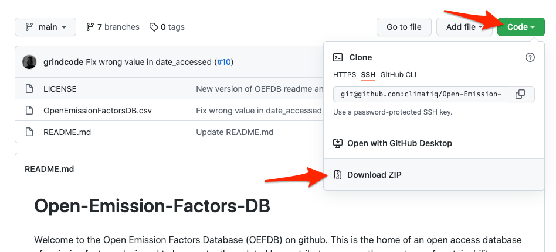
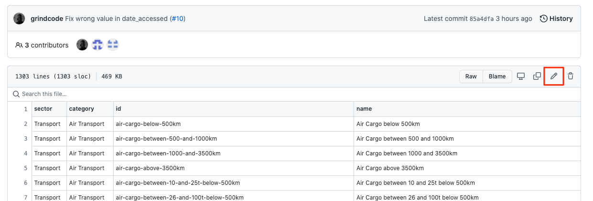
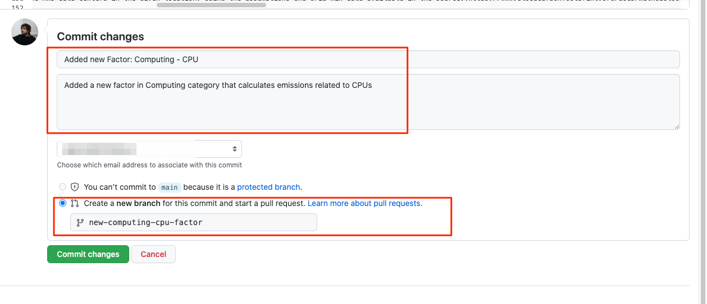
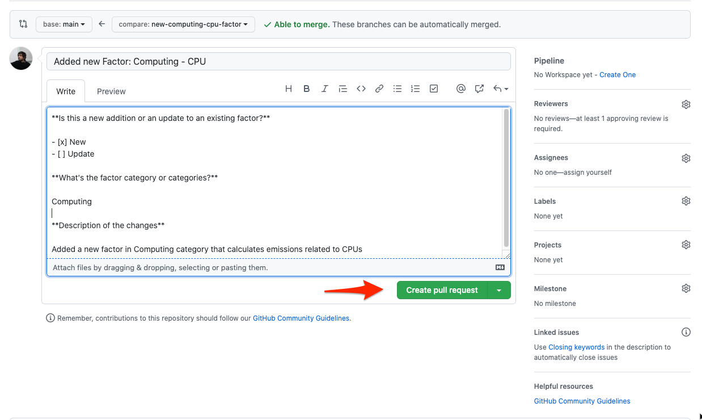
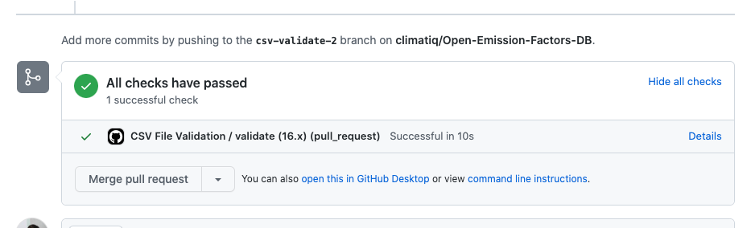
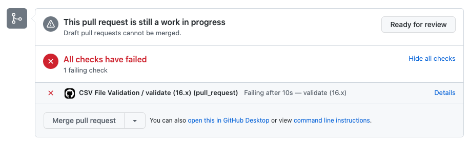
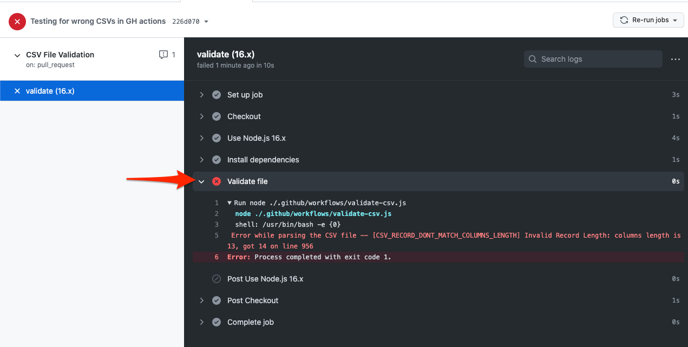

# Contributing guide

It's straightforward to contribute to the Open Emission Factors Database, and by doing so you are adding value to a crucial resource for the measurement of emissions - thank you! 

This document aims to be a simple guide for users with or without Git experience. To contribute by creating or updating factors in the database for review by the OEFDB data stewards, follow these steps:

#### Table Of Contents

[How to add or change values in the Emission Factors CSV file](#how-to-add-or-change-values-in-the-emission-factors-csv-file)
   * [1. Edit the file](#1-edit-the-file) 
   * [2. Create a Pull Request](#2-create-a-pull-request)

[Git Commit Messages](#git-commit-messages)

## How to add or change values in the Emission Factors CSV file

### 1. Edit the file
1. Download a copy of this repository.
2. Open `OpenEmissionFactorsDB.csv` file with a CSV editor. You can work with any editor like Microsoft Excel, Google Sheets or Apple Numbers but keep an eye on the character encoding and make sure that they are all displayed well once the file is exported. The editor must be capable of editing documents with at least UTF-8 encoding and should be exported as such.

3. Make the changes to the file. Avoid adding new factors along with other factors updates - updates and additions should be submitted in separate requests.
4. Save or export the file as a `.csv` file separated by commas.
5. Open the `csv` file with a text editor (Right-click on the file > Open With... > TextEdit in Mac or Notepad in Windows).
6. Copy the content of the file.
7. Back to GitHub, click on `OpenEmissionFactorsDB.csv` file and then on the edit icon.
   
8. Paste the content in the text area.

### 2. Create a Pull Request

Now that you have made your changes or additions, you need to create a Pull Request so the changes can be reviewed before going live:

1. Commit the changes by completing the form. [Give it a proper title and specify if you are adding or updating an existing factor/factors](#git-commit-messages) and the category it/they belong to. Additionally, fill in the details of the template provided to make it clear why these changes are necessary or beneficial. This will speed up the revision process and make clear the reasons for the contribution.

2. Immediately after clicking the commit button, you will be prompted to create a new Pull Request. Please review the title and descriptions for clarity and brevity, then click on `Create Pull Request` and wait for approval or any alterations or clarifications required by the OEFDB data stewards.

## Pull Request Checks

Whenever a new Pull Request is created or altered, GitHub will automatically check if the CSV is valid or not. Make sure that your Pull Request does not throw any errors during the validation. These checks results will be displayed in the Pull Request screen:

If the file is fine, you will see this section in your Pull Request details:

If there has been a validation error, this will be the section instead:

Click on details and then on Validate file to expand the error details:

## Git Commit Messages

In order to keep a good Git history, take the following guidelines about commit messages into account:

- Use the imperative mood ("Add new factor" not "Added new factor").
- Limit the first line to 72 characters or less.
- Reference issues and pull requests liberally after the commit title. If you need to link to another Pull Request, do it after the commit title.
