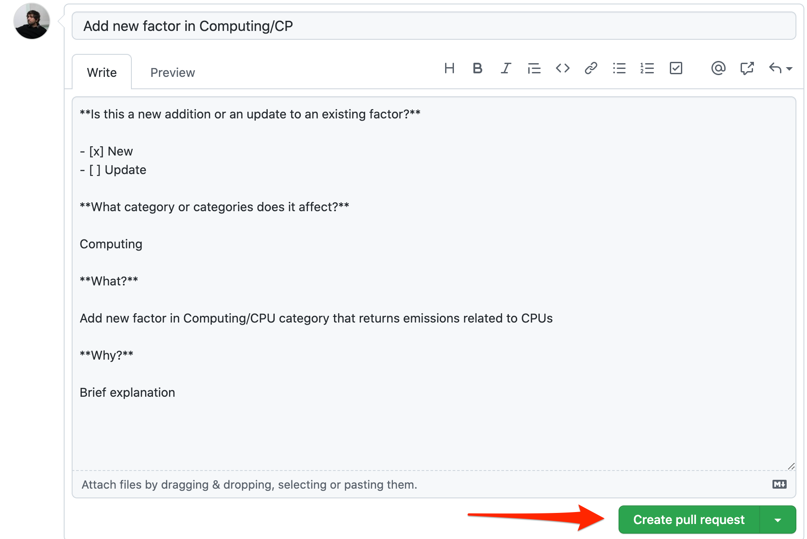

## Contributing guide

Thank you for thinking about contributing to the Open Emission Factors Database! To contribute by creating or updating factors in the database, follow these steps:

### 1. Edit the file
1. Download a copy of this repository.
2. Open `OpenEmissionFactorsDB.csv` file with a CSV editor. You can work with any editor like Microsoft Office or Apple Numbers but keep an eye on the characters encoding and make sure that they are all displayed well.

3. Make the changes to the file. Try to keep them as short as possible and do not try to addnew factors along with other factors updates. Try to do both in separate requests.
4. Save or export the file as a `.csv` file separated by commas.
5. Open the `csv` file with a text editor (Right-click on the file > Open With... > TextEdit in Mac or Notepad in Windows).
6. Copy the content of the file.
7. Back to GitHub, click on `OpenEmissionFactorsDB.csv` file and then in the edit icon.
8. Paste the content in the text area.

### 2. Create a Pull Request

Now that you have edit your changes, you need to create a Pull Request so the changes can be reviewed before going live:

1. Commit the changes by completing the form. Give it a proper title and specify if you are adding or updating an existing factor and the category it belongs to. Additionally, insert a description with any extra data to speed up the revision process and give the branch a name that can be identified easily

2. Immediately after, you will be redirected to another screen to create a new Pull Request. If the title and descriptions are fine for you, click on `Create Pull Request` and wait for approval or changes requests.

